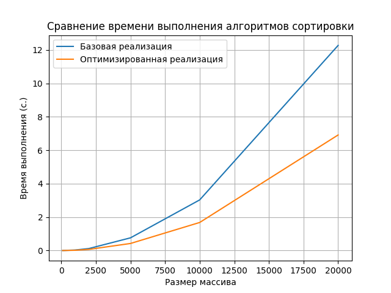

# СЛОЖНОСТЬ АЛГОРИТМОВ И ИХ ОПТИМИЗАЦИЯ

## Цель работы
Получить навыки вычисления сложности алгоритмов и их оптимизации различными методами.

## Сортировка выбором
### Описание алгоритма
1. Начинаем с предположения, что первый элемент массива уже отсортирован. Далее итеративно проходим по оставшимся элементам.
2. На каждом шаге текущий элемент вставляется в правильную позицию в отсортированной части массива.
3. Для этого сравниваем текущий элемент с элементами в отсортированной части массива и перемещаем его влево, пока не найдём правильную позицию.

### Сложность алгоритма

- В худшем и среднем случае: **O(n^2)**, так как в худшем случае мы должны выполнить n-1 сравнений для каждого из n элементов.

### Результаты замеров



### Базовая реализация
В данной реализации используется вложенный цикл для поиска наименьшего элемента. Если индекс вложенного цикла меньше, 
чем основного, то мы пропускаем итерацию.

### Оптимизированная реализация
В оптимизированной реализации исправляется стартовый индекс вложенного цикла. Кроме того, вместо того чтобы каждый раз 
менять элементы местами при обнаружении минимального элемента, мы просто запоминаем индекс минимального элемента и после завершения внутреннего цикла выполняем обмен только один раз. Это позволяет сократить количество операций присваивания.


### Логи программы
```shell
Размер массива: 100
Базовая реализация: 0.00028634071350097656 с.
Оптимизированная реализация: 0.00016498565673828125 с.
------------------------------
Размер массива: 1000
Базовая реализация: 0.029118061065673828 с.
Оптимизированная реализация: 0.01665806770324707 с.
------------------------------
Размер массива: 2000
Базовая реализация: 0.11869597434997559 с.
Оптимизированная реализация: 0.0682380199432373 с.
------------------------------
Размер массива: 5000
Базовая реализация: 0.7587070465087891 с.
Оптимизированная реализация: 0.42148470878601074 с.
------------------------------
Размер массива: 10000
Базовая реализация: 3.0299389362335205 с.
Оптимизированная реализация: 1.6787729263305664 с.
------------------------------
Размер массива: 20000
Базовая реализация: 12.277521133422852 с.
Оптимизированная реализация: 6.91743803024292 с.
------------------------------
```

## Вывод
Видно, что с увеличением размера массива время выполнения как базовой, так и оптимизированной реализации сортировки 
выбором также увеличивается, что ожидаемо. Однако оптимизированная реализация работает быстрее базовой во всех случаях. 
Это подтверждает эффективность оптимизации алгоритма

Например, при размере массива 10000 базовая реализация занимает около 3 секунд, тогда как оптимизированная реализация 
завершает работу за примерно 1.68 секунды. 